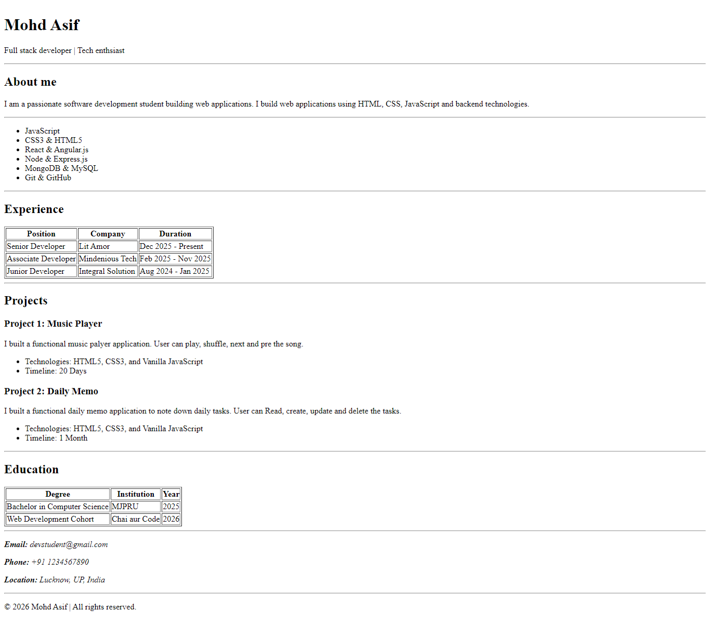

# HTML Resume Peer Project

I created this resume project using HTMl. <br/>
See the project [click](https://template-repo-cohort.vercel.app/)

## Resume

<!-- -->

![Resume][def]

[def]: ./Resume.png

## How to setup project locally

<ul>
<li>Run the following command in the terminal</li>
```bash
git clone https://github.com/AsifKhan-7/template-repo-cohort
```
<li>Once repo is clone, open it in the IDE</li>
<li>Start the server</li>
<li><b>npm run dev</b></li>
</ul>
